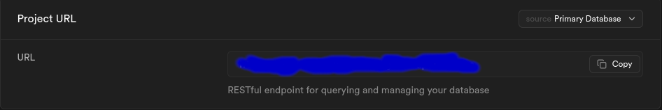
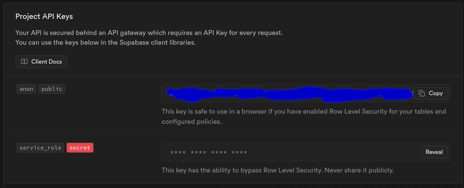

# SDC - Bank

[](https://travis-ci.org/joemccann/dillinger)

Project developed within the scope of Projeto Integrado`s class at CTESP Informatica at IPT

## Installation

```bash
git clone git@github.com:sfd-sdc/ProjInt.git 
cd ProjInt 
```

Use the package manager [pip](https://pip.pypa.io/en/stable/) to install requirements

```bash
pip install -r requirements.txt
```

Create a file named .env to put your supabase credentials
See https://github.com/sfd-sdc/ProjInt/blob/main/.env.example

Go to supabase (https://supabase.com) and select your project:
- Project Settings > API 

In API Settings, copy your project URL (not the url on the browser) and paste in the URL field in.env file


In Project API KEYS, copy anon/public key and paste it in the KEY field in.env file


## Usage

In the root of the project run:

```bash
python3 flaskr/app.py
```

Go to your browser and navigate to: https://localhost:5000

This project is being developed by:
- Pedro Espirito Santo
- Rodrigo Lucindo
- Joao Pinheiro Ferreira
- Joao Bagueixo Ferreira
